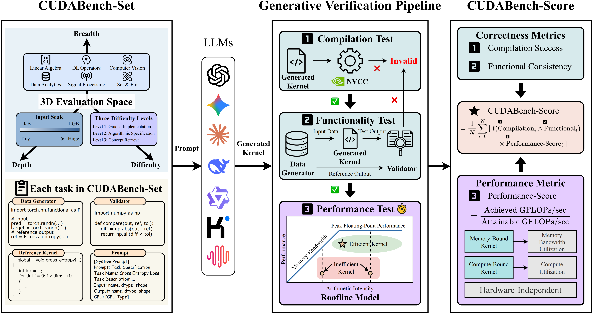

# CUDABench
[](https://huggingface.co/datasets/CUDABench/CUDABench-Set) 
**CUDABench** is a comprehensive benchmark designed to evaluate the text-to-CUDA capabilities of LLMs. It provides a complete pipeline from dataset management to CUDA code generation and automated performance evaluation on NVIDIA GPUs.



## 📁 Directory Structure

```text
CUDABench/
├── Datasets/           # Contains benchmark tasks (prompts, reference code)
│   └── CUDABench-Set.jsonl
├── Generate/           # LLM inference engine
│   ├── main.py
│   ├── config.py
│   └── ...
├── Evaluate/           # Evaluation engine (Compilation & Profiling)
│   ├── manager.py
│   └── ...
└── Results/            # Output directory for generated code
    └── <api_provider>/

```

---

## 🛠 Prerequisites

Before running the benchmark, ensure you have the following installed:

* **CUDA Toolkit (`nvcc`)**: Required for compiling generated kernels.
* **NVIDIA Nsight Compute (`ncu`)**: Required for profiling performance metrics.

---

## 🚀 Usage Workflow

### 1. Dataset: CUDABench-Set

The benchmark is driven by `Datasets/CUDABench-Set.jsonl`. Each line in this file is a JSON object representing a unique CUDA task.

**Key Fields per Task:**

* **Metadata**:
  * `id`, `task_name`: Unique identifiers for the problem.
  * `inputs` / `outputs`: Definitions of tensor shapes and data types.


* **Prompts (Difficulty Levels)**:
  * `level1_prompt`: **Guided Implementation**, providing the task name, a detailed algorithm description, and explicit CUDA implementation guidelines (e.g., memory hierarchy usage and thread-mapping strategies).
  * `level2_prompt`: **Algorithmic Specification**, including the task name and algorithm description, but omits all hardware-specific guidance.
  * `level3_prompt`: **Concept Retrieval**, supplying only the task name..


* **Evaluation Components**:
  * `bench.cu`: The reference CUDA C++ implementation.
  * `gen.py`: Python script used to generate random binary input data and reference output data for testing.
  * `compare.py`: Python script used to validate the correctness of the generated kernel against the reference.


**Example Entry (Simplified):**

```json
{
  "id": 16,
  "task_name": "ReLU_Activation_Fuction",
  "inputs": [{"name": "relu_input", "dtype": "float32", "shape": "(1048576,)"}],
  "level1_prompt": "...",
  "level2_prompt": "...",
  "level3_prompt": "...",
  "bench.cu": "#include <cuda_runtime.h> ...",
  "gen.py": "import numpy as np ...",
  "compare.py": "def compare_outputs(...) ..."
}
```

### 2. Generate

Use the `Generate` module to query LLMs (DeepSeek, OpenAI, etc.) and generate CUDA kernels.

**Basic Command:**

```bash
python Generate/main.py
```

**With Arguments (Example):**

```bash
python Generate/main.py --api_option deepseek --model_name deepseek-reasoner --samples 3
```

* **Configuration:** You can modify defaults in `Generate/config.py` or pass arguments via CLI.
* **Output:** Generated code is saved to `Results/<api>/<model>_<level>_pass<k>.jsonl`.

### 3. Evaluate

Use the `Evaluate` module to compile, run, and profile the generated code against the reference implementation.

**Command:**

```bash
python Evaluate/manager.py full <path_to_results_file>
```

**Example:**

```bash
python Evaluate/manager.py full Results/deepseek/deepseek-reasoner_level3_pass3.jsonl
```